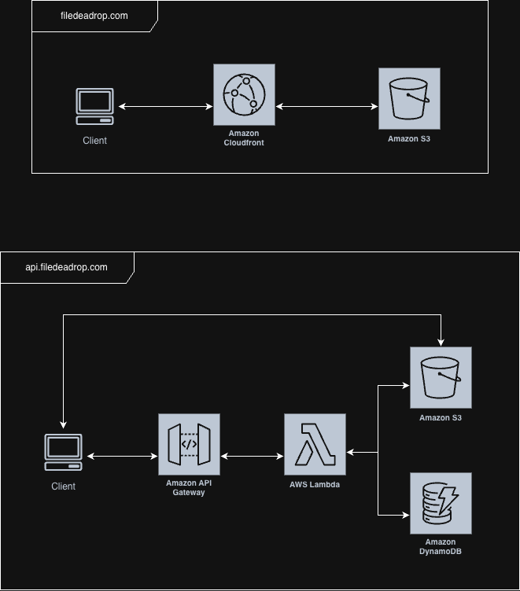
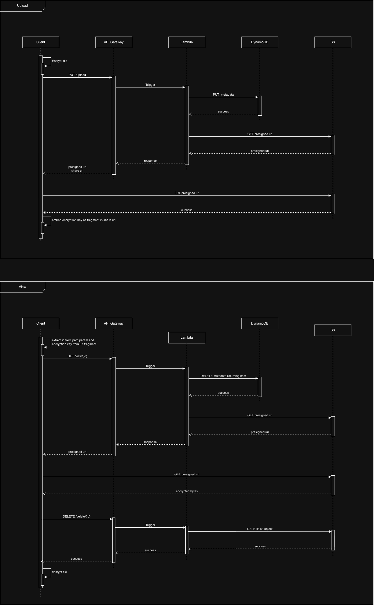

# FileDeadrop

A one-time, end-to-end encrypted file sharing service. Upload a file, receive a share link, and the file is permanently deleted after the first access or 24 hours — whichever comes first.

Files are encrypted entirely in the browser before upload. The encryption key never leaves the client and is never transmitted to any server.

---

## How It Works

### Upload

1. The browser generates an AES-GCM-128 key using the Web Crypto API
2. The file is encrypted client-side; the IV is prepended to the ciphertext
3. The client selects a storage region (US or EU) and calls the corresponding regional API to request a presigned S3 URL
4. The encrypted bytes are uploaded directly to S3 — they never pass through the application server
5. The encryption key, AES-GCM-encrypted filename, and storage region (encoded in the share URL host) are embedded in the share link — e.g. `eu.filedeadrop.com/view/{id}#key:filename` for an EU upload

### View

1. The recipient opens the share link; the browser extracts the share ID from the URL path and the encryption key from the URL fragment
2. The client calls the API, which atomically deletes the DynamoDB record and returns a presigned S3 GET URL — this is the one-time access gate
3. The encrypted file is fetched directly from S3
4. The browser decrypts the file using the key from the fragment and offers it for download

Because the key lives exclusively in the URL fragment, it is never sent to any server in any request.

---

## Architecture

### System



### Sequences



---

## Key Technical Decisions

**Encryption key in the URL fragment**
URL fragments (`#`) are never included in HTTP requests. Placing the key there means it is invisible to the API, S3, CloudFront, and any server-side logs — even if traffic were intercepted at the network layer.

**Direct S3 transfer via presigned URLs**
File bytes flow directly between the browser and S3. The Lambda function handles only metadata — issuing presigned URLs and writing to DynamoDB — which keeps Lambda costs low and removes it as a bottleneck for large files.

**File size enforcement at the storage layer**
The presigned PUT URL is signed with an exact `ContentLength` matching the encrypted payload size. S3 rejects any upload where the `Content-Length` header doesn't match the signed value, preventing oversized uploads regardless of how the URL was obtained. The Lambda also validates the size before issuing the URL. The 25MB limit applies to the original file; the Lambda threshold adds 28 bytes to accommodate AES-GCM overhead (12-byte IV + 16-byte auth tag).

**DynamoDB conditional delete as the access gate**
The view Lambda performs a conditional `DeleteItem` with `ReturnValues: ALL_OLD`. If the item no longer exists (already accessed or expired), the delete fails and the Lambda returns an error — preventing any race condition where two simultaneous requests could both retrieve the file.

**S3 lifecycle policy for TTL**
A 24-hour S3 lifecycle rule handles object expiry independently of application logic, ensuring files are cleaned up even if the DynamoDB record is deleted before the object is accessed.

**Encrypted filename in the URL fragment**
The original filename is encrypted with the same AES-GCM key (a fresh IV is generated independently) before being embedded in the fragment. The filename is never sent to any server and is only recoverable by someone who holds the key — making the share link the sole source of both file and filename access.

**Regional data residency**
Users choose a storage region (US or EU) at upload time. The share URL host encodes where the file is stored — `us.filedeadrop.com/view/...` for US, `eu.filedeadrop.com/view/...` for EU. The view page derives the correct regional API URL from `window.location.hostname` at runtime, so no rebuild is needed to add a region and files never cross regional boundaries.

**Anonymous access**
No accounts, sessions, or cookies. The share link is the only credential.

---

## Stack

| Layer | Technology |
|---|---|
| Frontend | React 19, TypeScript ~6.0, Vite |
| Routing | React Router DOM v7 |
| Styling | CSS Modules, Inter + JetBrains Mono (Google Fonts) |
| Encryption | Web Crypto API (AES-GCM-128) |
| Backend | AWS Lambda (Node.js) |
| IaC | Terraform |
| API | AWS API Gateway (HTTP API) |
| Storage | Amazon S3 |
| Database | Amazon DynamoDB |
| CDN / Hosting | Amazon CloudFront |
| DNS / TLS | Route 53, ACM |

---

## Local Development

```bash
# Install dependencies
npm install

# Set environment variables (gitignored by Vite)
cp .env.example .env.local
# Edit .env.local:
#   VITE_API_URL=https://dev.api.filedeadrop.com
#   VITE_DEV_API_KEY=your-dev-api-key   # must match dev_api_key in secrets.tfvars

# Start the dev server
npm run dev

# Type check and build
npm run build
```

---

## Deployment

Path-filtered GitHub Actions workflows trigger on push to `dev` or `main`. Authentication uses OIDC (`aws-actions/configure-aws-credentials`) — no long-lived AWS credentials are stored in GitHub.

### Frontend (`deploy-frontend.yml`)
Triggers on push to `main` with changes to `src/**`, `public/**`, `index.html`, `vite.config.*`, `package*.json`.

1. `npm ci` + `npm run build`
2. `aws s3 sync dist/ s3://<bucket> --delete`
3. CloudFront invalidation (`/*`) to serve the fresh build immediately

### Infrastructure & Lambda (`deploy-terraform.yml`)
Triggers on changes to `terraform/**` or `api/lambda/**`. Runs `terraform apply` from the appropriate environment directory — `terraform/environments/dev/` on `dev`, `terraform/environments/prod/` on `main`. Provisions all AWS infrastructure and packages/deploys Lambda code in a single step. Lambda function names follow the pattern `${env}-filedeadrop-{function}`.

**GitHub secrets — repository level** (frontend workflow)

| Secret | Description |
|---|---|
| `AWS_ROLE_ARN` | IAM role assumed via OIDC |
| `S3_BUCKET_NAME` | Destination S3 bucket |
| `CLOUDFRONT_DISTRIBUTION_ID` | Distribution invalidated after each deploy |
| `VITE_API_URL` | Local dev fallback only — production API routing is hostname-based at runtime |

**GitHub secrets — `dev` environment** (Terraform workflow, dev branch)

| Secret | Description |
|---|---|
| `AWS_ROLE_ARN` | IAM role assumed via OIDC |
| `TF_VAR_ROUTE53_ZONE_ID` | Hosted zone ID for `filedeadrop.com` |
| `TF_VAR_DEV_API_KEY` | Dev API key — must match `VITE_DEV_API_KEY` in `.env.local` |

**GitHub secrets — `production` environment** (Terraform workflow, main branch)

| Secret | Description |
|---|---|
| `AWS_ROLE_ARN` | IAM role assumed via OIDC |
| `TF_VAR_ROUTE53_ZONE_ID` | Hosted zone ID for `filedeadrop.com` |
